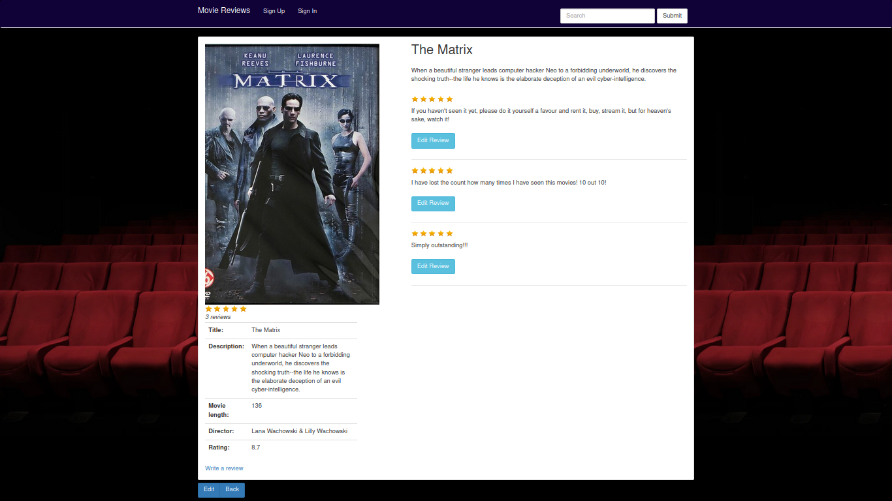

# Movies Review

This is a basic movie review website built in Ruby on Rails. The need to sign up in order to add a new movie and write reviews. Users can also add a star rating review.




### Installing Movies Review

Clone the repo

Change to its directory:
```cd Movies-Review```

Run ```bundle install```

Run ```rails db:create db:migrate```

If you want to play with the app, you can populate the database with some mock data by running:

```rails db:seed```

Run ```rails server``` to start the server.

Open you browser and go to ```localhost:3000```

Now have fun!


### Technologies used

* Ruby 3.0.X
* Rails 6.1.X
* Haml
* Postgres
* Sass
* Paperclip
* Devise


### To Do

* Refactor controllers to increase methods' single responsability
